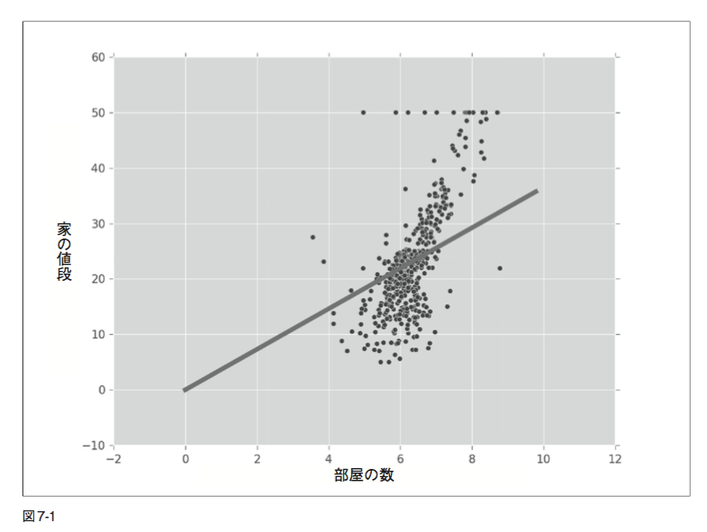
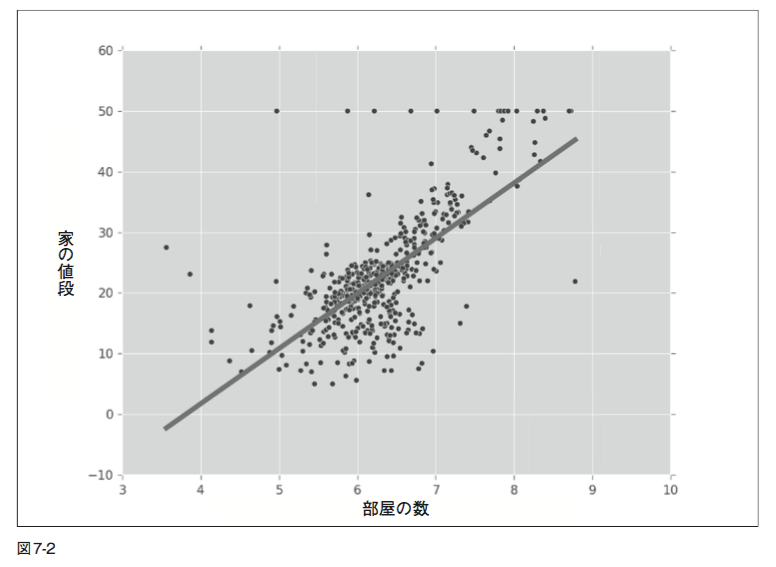
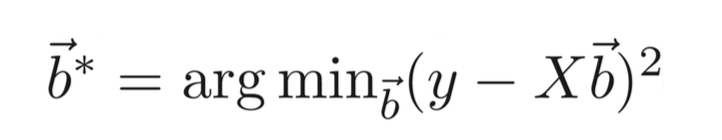
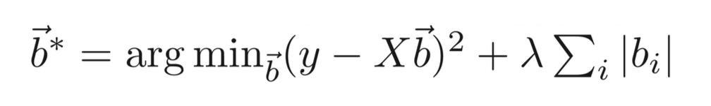
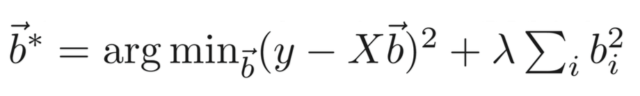

# Bulding Machine Learning Systems with Python
# 実践 機械学習システム

## 7章 回帰:レコメンド
- 最小二乗法による回帰(古典的手法)の復習
	- 高速に実行できる
	- 現実の多くの問題に対して効果的
	- 特徴量の数がサンプルデータの数より大きい場合正しく扱えない
- Numpy, scikit-learnによる実行
- より進んだ手法 (lasso、ridge、elastic nets) の紹介
	- 古典的手法でうまく扱えない問題(特徴量の数が多い場合など)に対して有効
- レコメンドについての基礎

###7.1 回帰を用いて物件価格を予測する
ボストンにある物件について、その価格を予測する問題を考える。

#### 目標
    入力 : エリアの指定
    出力 : その周辺にある家の値段の中央値 (median)

#### データセット
以下の情報がデータセットで与えられる。

- 犯罪発生率
- 人口統計に関する情報
	- 「先生一人あたりに対する生徒の数」など 
- 地理情報

#### データセットの読み込み
scikit-learnに組み込まれているため以下のようにデータを読み込める。
サンプル数：506

```python
from sklearn.datasets import load_boston
boston = load_boston()
```

`boston` オブジェクトは属性 (attribute) をいくつか持ち 、主に以下を用いる
- `boston.data` : (X) 特徴量がいろいろ入っている 
- `boston.target` : (Y) ラベル、各エリアの家の値段の中央値 (今回の問題の目標変数 : target variable) 
     
`boston. DESCR`, `boston.feature_names` でデータセットの詳細が確認できる。

#### 特徴量が一次元の回帰
各エリアにおける 1 軒あたりの部屋数の平均値だけを用いて、家の値段を予測したい。
特徴量の部屋数の平均値は配列のインデックスが 5 の場所に格納されている。

`boston.data[:,5]` : 各エリアにおける 1 軒あたりの部屋数の平均値の系列

以下で、各エリアにおける 1 軒あたりの部屋数の平均値に対してのその周辺にある家の値段の中央値をプロットできる。

```python
from matplotlib import pyplot as plt
plt.scatter(boston.data[:,5], boston.target, color='r’)
plt.show()
```

上記の問題に対して、標準的な最小二乗法による回帰を用いることできる。Numpy のnp.linalg サブモジュールから基本的な 線形代数の基本的な演算を行う関数を使う。今回は特徴量が１次元なので、`y = cx`の傾き`c`を求めればよい。

```python
import numpy as np
x = boston.data[:,5]
x = np.array([[v] for v in x]) #xを二次元配列に書き換える
```

xを二次元配列にすることで、一つ目の次元には、異なるサンプルデータを、二つ目の次元には特徴量の要素を格納できる。今回は特徴量が１つなので 二つ目の次元の大きさは１になる。

`x = array( [ 6.575,  6.421,  7.185,…] )`

↓

`x = array( [ [6.575], [6.421], [7.185],... ] )`


```python
y = boston.target
slope,total_error ,_,_ = np.linalg.lstsq(x,y)
rmse = np.sqrt(total_error[0]/len(x)) #平均二乗平方根誤差(root mean squared error:RMSE)
```
回帰直線の傾きを得るために、最小二乗法による回帰を行う。
np.linalg.lstsq 関数は、回帰がどれだけデータにあてはまるかということに関する以下の情報などをいくつか返す。`y` を「家の値段」、`x` を「部屋の数」として、`y = cx` という直線で近似することを意味する(最小二乗法により傾きcを求める)。
- `slope` : 近似直線の傾き
- `total_error` : 二乗誤差の総和

今回は、slope に傾きが格納され、傾きをとcして y = cx をグラフにプロットすると以下のようになる。また二乗誤差の総和から訓練データにおける平均二乗平方根誤差(root mean squared error:RMSE)が求まる。

`RMSE on training: 7.64268509309`



上記のグラフから、特徴量の要素が一つだけのモデルを用いると、以下のことがわかる。
- 全然うまくいかない
- 「家の値段」が 「部屋の数」の倍数になってしまい明らかに誤り

#### バイアス項の追加
次にとるべき策として、バイアス項の追加を行う。それによって、「家の値段」は「部屋の数」の倍数にバイアスを足した式 `y = cx + b` で表現される。 このバイアスは、“部屋のない 家”の値段を表す。これを実装するためには、`x` の各要素に 1 を追加する。

```python
x = boston.data[:,5]
x = np.array([[v,1] for v in x])     #[v]の代わりに[v,1]を使用
y = boston.target
(slope,bias),total_error,_,_ = np.linalg.lstsq(x,y)
```
c = slope, d = bias とすると、y = cx + d とすると結果は、以下の図7-2のようになる。外れ値(outlier)がいくつかあり、それらには上手く対応できていないが、結果は見るからに良くなっている。

`RMSE on training: 6.60307138922`


#### モデルの定量的な評価
このモデルがどれぐらい上手くデータに適合できているか、定量的な評価を行いたい。
このモデルの予測が、どれぐらい正解に近いか、np.linalg.lstsq が返す二つ目の値 (total_error) を見ればわかる。

`(slope,bias),total_error,_,_ = np.linalg.lstsq(x,y)`

np.linalg.lstsq は、二乗誤差の合計を返す (total_error)。つまり、各サンプルデータで誤差(直線と データとの距離)を求め、それを二乗し、すべてを足し合わせ、その合計を返す。 
平均誤差を求めたほうが理解しやすいため、二乗誤差の合計をサンプルデータの数で割り、最後に平方根を計算する。ここで求めた値は、平均二乗平方根誤差(root mean squared error:RMSE)と言う。
#####平均二乗平方根誤差と予測
RMSE の値は近似的には標準偏差に対応する。ほとんどのデータは平均値から標準偏差
二つ分の範囲に収まる。そのため、RMSEを2倍した値がおおよその信頼区間 (confidence interval)に相当する。これは誤差が正規分布に従う場合成り立つことだが、そうでなくてもおおよそ正しい結果になる。

##### 評価結果
	１次元のfeatureのみ : `RMSE on training: 7.64268509309`
	１次元のfeature + バイアス項 : `RMSE on training: 6.60307138922`

バイアス項を用いなかった場合、RMSE は 7.6 であるのに対して、バイアス項を追加した場合は 6.6 に改善される。この結果から、私たちが予測する家の値段の誤差(実際の値段との差)は多くても1300(e^6.6 *2)ドルの範囲内に収まるであろうと考えられる。

###7.1.1 多次元回帰
全ての要素を特徴量として用いる。

	入力 : 複数の特徴量
	出力 :  一つの値(家の値段の平均)の予測


```python
x = boston.data
# np.concatenateは二つの配列・リストを結合する
# vは複数の要素を持つ配列であるため、np.concatenateを用いて、バイアス項を追加
x = np.array([np.concatenate( [ v,[1] ] ) for v in x]) #教科書の例はカッコが足りない
y = boston.target
s,total_error,_,_ = np.linalg.lstsq(x,y)
rmse = np.sqrt(total_error[0]/len(x))
```
`RMSE on training: 4.6795063006355182`

sに各特徴量に対応した傾きが格納される。RMSEの評価値は4.7となり、前よりも良くなった。

###7.1.2 回帰における交差検定
- 「分類器を評価するために交差検定を用いることが大切である」
- 回帰
	- 交差検定が常に行われるとは限らない
	- これまでの例では訓練誤差だけを用いて議論
	- 最小二乗法はとても単純なモデルであるため、大きな誤りを起こすことは多くはない

しかし、汎化に関する能力について考察を行うのであれば、正しい実験に基づいて評価すべきである。

#### scikit-learn を用いた交差検定
##### LinearRegression
線形回帰専用のクラスであり、最小二乗法による回帰は以下のように行える。

```python
from sklearn.linear_model import LinearRegression
lr = LinearRegression(fit_intercept=True)
```
`fit_intercept=True` : バイアス項を追加

次にやることは以前と同じだが、より便利なインターフェイスである`fit()`, `predict()`を利用し、学習と予測を行う。（教科書では `map()`も利用しているが、バージョンが変わったせいか必要無し)

```python 
lr.fit(x,y) #学習
p = lr.predict(x) #予測
e = p-y #訓練誤差
total_error = np.sum(e*e) #二乗誤差
rmse_train = np.sqrt(total_error/len(p)) #訓練RMSE
print('RMSE on training: {}'.format(rmse_train))
```

`RMSE on training: 4.67950630064`

ここでは7.1.1とは違い訓練データのRMSEを`sklearn.linear_model.LinearRegression`を利用して求めた。結果は同じ4.6になる。

##### 10-fold cross validation １０分割交差検定
`sklearn.cross_validation.KFold`を利用し、10分割の交差検定を行い、線形回帰の汎化能力についての評価を行う。

```python
from sklearn.cross_validation import KFold 
kf = KFold(len(x), n_folds=10)
err = 0
for train, test in kf:
    lr.fit(x[train],y[train])
    p = lr.predict(x[test])
    e = p-y[test]
    err += np.sum(e*e)
rmse_10cv = np.sqrt(err/len(x))
print('RMSE on 10-fold CV: {}'.format(rmse_10cv))
```
`RMSE on 10-fold CV: 5.88192507243`
結果は5.6になり、訓練誤差4.6より大きくなる。交差検定では、学習データとテストデータを分割するため汎化能力についてより正しい評価を行っていると言える。

##### 最小二乗法
- モデルが単純
- 予測が高速


##7.2 罰則付き回帰

##### 罰則付き回帰(penalized regression)
- 最小二乗法による回帰から派生した手法
- パラメータが過剰に適合するのに対して罰則を追加
	- 通常の回帰 : 訓練データに最も適合したパラメータを返すが過学習の可能性がある
- 「バイアス - バリアンスのトレードオフ」の一例	

### 7.2.1 L1, L2罰則項
##### 回帰で用いる罰則項(正規化項)
- L1 : 係数の絶対値の和
- L2 : 係数の二乗和

最小二乗法による最適化を行う式：目標変数である y と二乗距離が最小となるようなベクトル b を見つける。



L1罰則項 「Lasso回帰」 の追加：誤差を小さくすると同時に係数 (絶対値の項)も小さくする。


L2罰則項「Ridge回帰」の追加：二乗を罰則として用いる



