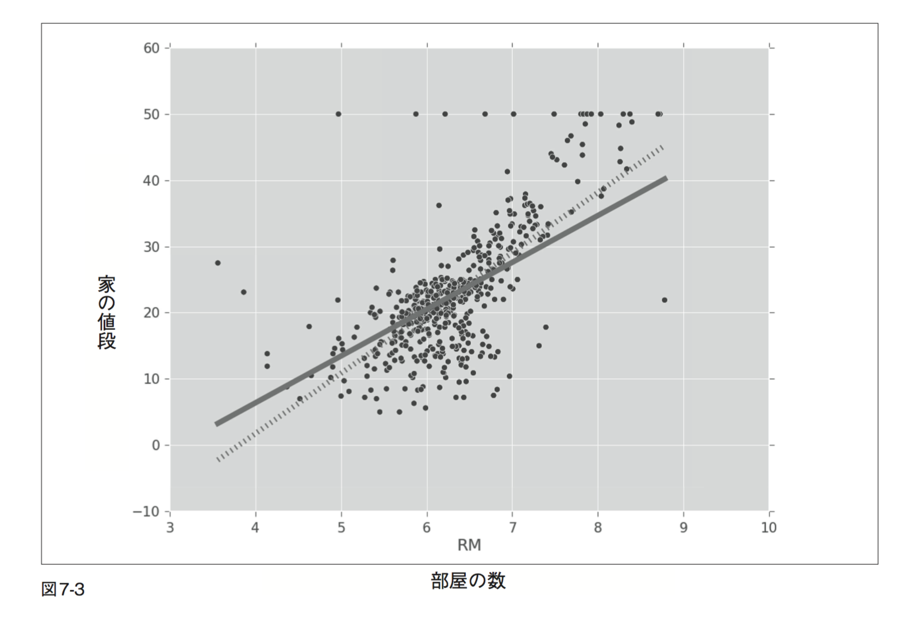
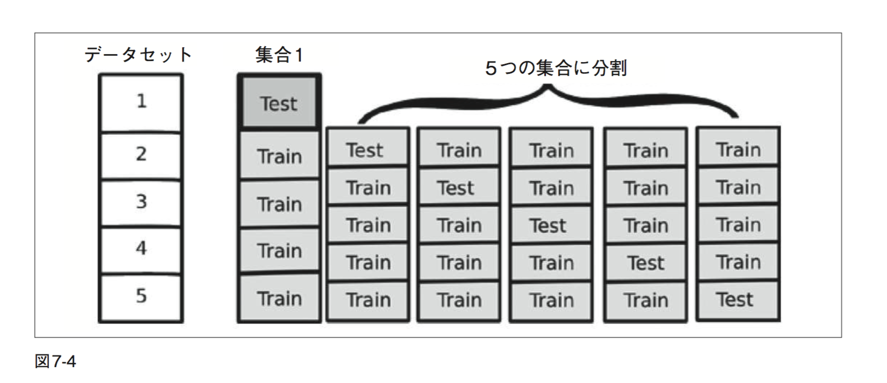

# Bulding Machine Learning Systems with Python
# 実践 機械学習システム

## 7章 回帰:レコメンド
- 最小二乗法による回帰(古典的手法)の復習
	- 高速に実行できる
	- 現実の多くの問題に対して効果的
	- 特徴量の数がサンプルデータの数より大きい場合正しく扱えない
- Numpy, scikit-learnによる実行
- より進んだ手法 (lasso、ridge、elastic nets) の紹介
	- 古典的手法でうまく扱えない問題(特徴量の数が多い場合など)に対して有効
- レコメンドについての基礎

###7.1 回帰を用いて物件価格を予測する
ボストンにある物件について、その価格を予測する問題を考える。

#### 目標
    入力 : エリアの指定
    出力 : その周辺にある家の値段の中央値 (median)

#### データセット
以下の情報がデータセットで与えられる。

- 犯罪発生率
- 人口統計に関する情報
	- 「先生一人あたりに対する生徒の数」など 
- 地理情報

#### データセットの読み込み
scikit-learnに組み込まれているため以下のようにデータを読み込める。
サンプル数：506

```python
from sklearn.datasets import load_boston
boston = load_boston()
```

`boston` オブジェクトは属性 (attribute) をいくつか持ち 、主に以下を用いる
- `boston.data` : (X) 特徴量がいろいろ入っている 
- `boston.target` : (Y) ラベル、各エリアの家の値段の中央値 (今回の問題の目標変数 : target variable) 
     
`boston. DESCR`, `boston.feature_names` でデータセットの詳細が確認できる。

#### 特徴量が一次元の回帰
各エリアにおける 1 軒あたりの部屋数の平均値だけを用いて、家の値段を予測したい。
特徴量の部屋数の平均値は配列のインデックスが 5 の場所に格納されている。

`boston.data[:,5]` : 各エリアにおける 1 軒あたりの部屋数の平均値の系列

以下で、各エリアにおける 1 軒あたりの部屋数の平均値に対してのその周辺にある家の値段の中央値をプロットできる。

```python
from matplotlib import pyplot as plt
plt.scatter(boston.data[:,5], boston.target, color='r’)
plt.show()
```

上記の問題に対して、標準的な最小二乗法による回帰を用いることできる。Numpy のnp.linalg サブモジュールから基本的な 線形代数の基本的な演算を行う関数を使う。今回は特徴量が１次元なので、`y = cx`の傾き`c`を求めればよい。

```python
import numpy as np
x = boston.data[:,5]
x = np.array([[v] for v in x]) #xを二次元配列に書き換える
```

xを二次元配列にすることで、一つ目の次元には、異なるサンプルデータを、二つ目の次元には特徴量の要素を格納できる。今回は特徴量が１つなので 二つ目の次元の大きさは１になる。

`x = array( [ 6.575,  6.421,  7.185,…] )`

↓

`x = array( [ [6.575], [6.421], [7.185],... ] )`


```python
y = boston.target
slope,total_error ,_,_ = np.linalg.lstsq(x,y)
rmse = np.sqrt(total_error[0]/len(x)) #平均二乗平方根誤差(root mean squared error:RMSE)
```
回帰直線の傾きを得るために、最小二乗法による回帰を行う。
np.linalg.lstsq 関数は、回帰がどれだけデータにあてはまるかということに関する以下の情報などをいくつか返す。`y` を「家の値段」、`x` を「部屋の数」として、`y = cx` という直線で近似することを意味する(最小二乗法により傾きcを求める)。
- `slope` : 近似直線の傾き
- `total_error` : 二乗誤差の総和

今回は、slope に傾きが格納され、傾きをとcして y = cx をグラフにプロットすると以下のようになる。また二乗誤差の総和から訓練データにおける平均二乗平方根誤差(root mean squared error:RMSE)が求まる。

`RMSE on training: 7.64268509309`


上記のグラフから、特徴量の要素が一つだけのモデルを用いると、以下のことがわかる。
- 全然うまくいかない
- 「家の値段」が 「部屋の数」の倍数になってしまい明らかに誤り

#### バイアス項の追加
次にとるべき策として、バイアス項の追加を行う。それによって、「家の値段」は「部屋の数」の倍数にバイアスを足した式 `y = cx + b` で表現される。 このバイアスは、“部屋のない 家”の値段を表す。これを実装するためには、`x` の各要素に 1 を追加する。

```python
x = boston.data[:,5]
x = np.array([[v,1] for v in x])     #[v]の代わりに[v,1]を使用
y = boston.target
(slope,bias),total_error,_,_ = np.linalg.lstsq(x,y)
```
c = slope, d = bias とすると、y = cx + d とすると結果は、以下の図7-2のようになる。外れ値(outlier)がいくつかあり、それらには上手く対応できていないが、結果は見るからに良くなっている。

`RMSE on training: 6.60307138922`


#### モデルの定量的な評価
このモデルがどれぐらい上手くデータに適合できているか、定量的な評価を行いたい。
このモデルの予測が、どれぐらい正解に近いか、np.linalg.lstsq が返す二つ目の値 (total_error) を見ればわかる。

`(slope,bias),total_error,_,_ = np.linalg.lstsq(x,y)`

np.linalg.lstsq は、二乗誤差の合計を返す (total_error)。つまり、各サンプルデータで誤差(直線と データとの距離)を求め、それを二乗し、すべてを足し合わせ、その合計を返す。 
平均誤差を求めたほうが理解しやすいため、二乗誤差の合計をサンプルデータの数で割り、最後に平方根を計算する。ここで求めた値は、平均二乗平方根誤差(root mean squared error:RMSE)と言う。
#####平均二乗平方根誤差と予測
RMSE の値は近似的には標準偏差に対応する。ほとんどのデータは平均値から標準偏差
二つ分の範囲に収まる。そのため、RMSEを2倍した値がおおよその信頼区間 (confidence interval)に相当する。これは誤差が正規分布に従う場合成り立つことだが、そうでなくてもおおよそ正しい結果になる。

##### 評価結果
	１次元のfeatureのみ : `RMSE on training: 7.64268509309`
	１次元のfeature + バイアス項 : `RMSE on training: 6.60307138922`

バイアス項を用いなかった場合、RMSE は 7.6 であるのに対して、バイアス項を追加した場合は 6.6 に改善される。この結果から、私たちが予測する家の値段の誤差(実際の値段との差)は多くても1300(e^6.6 *2)ドルの範囲内に収まるであろうと考えられる。

###7.1.1 多次元回帰
全ての要素を特徴量として用いる。

	入力 : 複数の特徴量
	出力 :  一つの値(家の値段の平均)の予測


```python
x = boston.data
# np.concatenateは二つの配列・リストを結合する
# vは複数の要素を持つ配列であるため、np.concatenateを用いて、バイアス項を追加
x = np.array([np.concatenate( [ v,[1] ] ) for v in x]) #教科書の例はカッコが足りない
y = boston.target
s,total_error,_,_ = np.linalg.lstsq(x,y)
rmse = np.sqrt(total_error[0]/len(x))
```
`RMSE on training: 4.6795063006355182`

sに各特徴量に対応した傾きが格納される。RMSEの評価値は4.7となり、前よりも良くなった。

###7.1.2 回帰における交差検定
- 「分類器を評価するために交差検定を用いることが大切である」
- 回帰
	- 交差検定が常に行われるとは限らない
	- これまでの例では訓練誤差だけを用いて議論
	- 最小二乗法はとても単純なモデルであるため、大きな誤りを起こすことは多くはない

しかし、汎化に関する能力について考察を行うのであれば、正しい実験に基づいて評価すべきである。

#### scikit-learn を用いた交差検定
##### LinearRegression
線形回帰専用のクラスであり、最小二乗法による回帰は以下のように行える。

```python
from sklearn.linear_model import LinearRegression
lr = LinearRegression(fit_intercept=True)
```
`fit_intercept=True` : バイアス項を追加

次にやることは以前と同じだが、より便利なインターフェイスである`fit()`, `predict()`を利用し、学習と予測を行う。（教科書では `map()`も利用しているが、バージョンが変わったせいか必要無し)

```python 
lr.fit(x,y) #学習
p = lr.predict(x) #予測
e = p-y #訓練誤差
total_error = np.sum(e*e) #二乗誤差
rmse_train = np.sqrt(total_error/len(p)) #訓練RMSE
print('RMSE on training: {}'.format(rmse_train))
```

`RMSE on training: 4.67950630064`

ここでは7.1.1とは違い訓練データのRMSEを`sklearn.linear_model.LinearRegression`を利用して求めた。結果は同じ4.6になる。

##### 10-fold cross validation １０分割交差検定
`sklearn.cross_validation.KFold`を利用し、10分割の交差検定を行い、線形回帰の汎化能力についての評価を行う。

```python
from sklearn.cross_validation import KFold 
kf = KFold(len(x), n_folds=10)
err = 0
for train, test in kf:
    lr.fit(x[train],y[train])
    p = lr.predict(x[test])
    e = p-y[test]
    err += np.sum(e*e)
rmse_10cv = np.sqrt(err/len(x))
print('RMSE on 10-fold CV: {}'.format(rmse_10cv))
```
`RMSE on 10-fold CV: 5.88192507243`
結果は5.6になり、訓練誤差4.6より大きくなる。交差検定では、学習データとテストデータを分割するため汎化能力についてより正しい評価を行っていると言える。

##### 最小二乗法
- モデルが単純
- 予測が高速


##7.2 罰則付き回帰

##### 罰則付き回帰(penalized regression)
- 最小二乗法による回帰から派生した手法
- パラメータが過剰に適合するのに対して罰則を追加
	- 通常の回帰 : 訓練データに最も適合したパラメータを返すが過学習の可能性がある
- 「バイアス - バリアンスのトレードオフ」の一例	

### 7.2.1 L1, L2罰則項
##### 回帰で用いる罰則項(正規化項)
- L1 : 係数の絶対値の和
- L2 : 係数の二乗和

##### 式による説明
最小二乗法による最適化を行う式：目標変数である y と二乗距離が最小となるようなベクトル b を見つける。


L1罰則項 「Lasso回帰」 の追加：誤差を小さくすると同時に係数 (絶対値の項)も小さくする。


L2罰則項「Ridge回帰」の追加：二乗を罰則として用いる


##### 特徴
- ElasticNet : L1, L2 を組み合わせたもの
- 罰則項を用いない場合の回帰に比べて、係数の値はより小さくなる
- `λ` によって罰則の強さを調整(`λ`が0に近づくにつれ最小二乗法に近づく)
- Lasso回帰 (L1)
	- より多くの係数が 0 になる(入力された特徴量の中でいくつかの要素を使用しない)
	- 特徴選択（上記）と回帰の両方を同時に行う

### 7.2.2 scikit-learnのLassoとElastic netを使用する
#### Elastic Net の利用
以下のようなコードでElasticNetが利用できる。
L1 罰則項を追加する場合は Lasso クラス、L2 罰則項を追加する場合は Ridge クラスが利用できる。

```python
from sklearn.linear_model import ElasticNet
en = ElasticNet(fit_intercept=True, alpha=0.5)
```

##### 訓練誤差

```python
en.fit(x,y)
p = en.predict(x)
e = p-y
total_error = np.sum(e*e)
rmse_train = np.sqrt(total_error/len(p))
print('RMSE on training: {}'.format(rmse_train))
```

`RMSE on training: 4.98547427243`

##### 交差検定
```python
err = 0
for train, test in kf:
    en.fit(x[train],y[train]) 
    p = en.predict( x[test])
    e = p-y[test]
    err += np.sum(e*e)
rmse_10cv = np.sqrt(err/len(x))
print('RMSE on 10-fold CV: {}'.format(rmse_10cv))
```
`RMSE on 10-fold CV: 5.47790646659`

##### 評価
- 訓練誤差は 5.0(前は 4.6)に増加、交差検定を用いた誤差は 5.4(前は 5.6)に減少
- 訓練誤差は大きくなったが、汎化性能が向上

##### 罰則項を利用しない場合とLasso回帰の場合の比較
###### 図7.3
- 点線 : 罰則項を用いない場合の回帰
- 実線 : Lasso 回帰の場合

Lasso 回帰のほうが、直線が水平に近くなっていることがわかる。まだ、Lasso 回帰の恩恵が明確ではないが、入力変数が多い場合、より顕著にその恩恵がわかるだろう。それでは、入力変数が多い場合を考察していく。



## 7.3 PがNより大きい場合(P greater than N)

	P : 特徴量の数
	N : サンプルデータの数
	
特徴量の数がサンプルデータの数より大きいことが「P が N より大きい」という表現で知られる

	入力：何かが書かれたテキストの集合
	特徴量 : 辞書に存在する単語を特徴量として回帰
	英単語 は 20000単語以上存在する (ステミングを行って、共通単語だけ考慮した場合の数字) 

例えば上記のような条件で、サンプルデータが数百または数千の場合、サンプルの数より特徴量の数のほうが大きくなる。

##### PがNより大きい場合
- サンプル数より特徴量の数のほうが大きいため、訓練データに対して完全にあてはめることが可能
- 連立方程式の数が変数の数より小さい場合、常に連立方程式の解を求めることができる(実際、連立方程式を満たす解は無限に存在)

つまり、訓練誤差が 0 になるような回帰係数を求めることができる。しかし、訓練誤差が 0 であるということは、汎化能力があることを意味せず、実際には汎化能力は極めて低くなるため、罰則項の効果を実感できるはずである。


#### 7.3.1 テキストに基づいたサンプルデータ
- テーマ：「10-K reports」のデータマイニング
	- 10-K reports : アメリカの SEC(米証券取引委員会)に提出する決算報告書

- 目標：その公になっている情報を基に、企業の株の推移を予測すること
	- 訓練データとして過去の データを用いるので、実際何が起こったかということについては既にわかっています。

- データ
	- 特徴量の数のほうがサンプルデータの数より大きい
	- サンプルデータ数 : 16,087 個 
	- 特徴量 : 個別の単語に対応 (150,360個)


##### データのDownload
180MB

```bash
curl -O http://www.csie.ntu.edu.tw/~cjlin/libsvmtools/datasets/regression/E2006.train.bz2
bunzip2 E2006.train.bz2
```

##### データの読み込み
データセットは SVMLight というフォーマットであり以下のように読み込める。
`target` は単純な一次元のベクトル、`data` は疎行列(ほとんどの要素が 0 であ るため、0 でない要素のみメモリに格納されます)

```python
from sklearn.datasets import load_svmlight_file
data,target = load_svmlight_file('data/E2006.train')
```

###### target の要素の確認

```python
print('Min target value: {}'.format(target.min()))
print('Max target value: {}'.format(target.max()))
print('Mean target value: {}'.format(target.mean()))
print('Std. dev. target: {}'.format(target.std()))
```

以下の結果からデータは -7.9から -0.5の間にあることがわかる。

```
Min target value: -7.89957807347
Max target value: -0.51940952694
Mean target value: -3.51405313669
Std. dev. target: 0.632278353911
```

##### 最小二乗法
まずは最小二乗法から見てみる。
また、平均二乗誤差を計算するのにより便利な関数 `sklearn.metrics.mean_squared_error`を利用して訓練誤差を求めると以下のようなコードとなる。

###### 訓練誤差
```python 
import numpy as np
from sklearn.metrics import mean_squared_error 
from sklearn.linear_model import LinearRegression
lr = LinearRegression()
lr.fit(data, target)
pred = lr.predict(data)
print('RMSE on training, {:.2}'.format(np.sqrt(mean_squared_error(target, pred))))
```
`RMSE on training, 0.0024`

訓練誤差は0.0024となり、完全に0にはならないが、これは丸め誤差が原因である。
次に交差検定を見てみる。

###### 交差検定
```python
from sklearn.cross_validation import KFold
lr = LinearRegression()
pred = np.zeros_like(target)
kf = KFold(len(target), n_folds=5)
for train, test in kf:
    lr.fit(data[train], target[train])
    pred[test] = lr.predict(data[test])
print('RMSE on testing (5 fold), {:.2}'.format(np.sqrt(mean_squared_error(target, pred))))
```
`RMSE on testing (5 fold), 0.75`
訓練誤差の場合と全く異なる結果となり、データの平均 が -3.5 であるので、標準偏差が 0.6 であることを考えると、
常に値が -3.5 と予測したとしてもRMSEは0.6程度にしかならないはずである。したがって、最小二乗法で訓練をした場合、改悪されたということになる。

##### ElasticNet
###### 正則化
- 過学習への対応策
- elastic netを用いて罰則パラメータ(λ)を 1 とする

###### 交差検定

```python
from sklearn.linear_model import ElasticNet
met = ElasticNet(alpha=0.1) # λ = 1 ?
kf = KFold(len(target), n_folds=5)
pred = np.zeros_like(target)
for train, test in kf:
    met.fit(data[train], target[train])
    pred[test] = met.predict(data[test])
print('[EN 0.1] RMSE on testing (5 fold), {:.2}'.format(np.sqrt(mean_squared_error(target, pred))))
```

`[EN 0.1] RMSE on testing (5 fold), 0.4`

RMSE は 0.4 になり、常に平均値を予測結果とする場合よりも良い結果となる。

### 7.3.2 ハイパ-パラメータの賢い設定方法
##### 罰則パラメータは様々な値が設定でき、結果も異なる
- 大きい値を設定した場合
	- 未学習の可能性が高くなる
	- 極端な場合として、 学習の結果、全ての係数が 0 になる
- 極端に小さい値を設定した場合
	- 最小二乗法に近づき、過学習、汎化能力が低下

##### 交差検定
- 最適なパラメータを設定する問題の一般的な解決策
- パラメータ候補を用意し、交差検定を用いて最適な値を一つ選出
- 時間がかかるが、公平な結果が期待できる
- 汎化能力を評価し最適なパラメータを選択するためには、二段階の交差検定が必要

##### 二段階の交差検定
- 一段階目：汎化能力を評価するため
- 二段階目：最適なパラメータを得るため

##### 例 : 10分割
- 一段階目
	- データを10分割し、10個の集合を作る。
		- データ 1      ：テスト用
        - データ 2 ~ 10 : 訓練用
- 二段階目：最適なパラメータ選択
     - 訓練データで10分割の交差検定を行う
最適なパラメータを選択した後、 先ほど除外したテスト用のデータ集合を用いて評価を行います。テスト用に除外するデータ集合を変更して、同じことを残り 9 回行います。


上の図の場合、一 段階目の交差検定では 5 つのグループに分割し、二段階目でも 5 つに分割

##### scikit-learn による二段階の交差検定
各罰則付き回帰に対して、`LassoCV`、 `RidgeCV`、 `ElasticNetCV` が用意されており、最適な内部パラメータの決定のために 交差検定を用いる機能を内部に持つ。alpha の値 (λ)を指定する必要がない点以外は、前のコードと同じになる。

```python 
from sklearn.cross_validation import KFold
from sklearn.linear_model import ElasticNetCV
met = ElasticNetCV(n_jobs=-1)
kf = KFold(len(target), n_folds=5)
pred = np.zeros_like(target)
for train, test in kf:
    met.fit(data[train], target[train])
    pred[test] = met.predict(data[test])
print('[EN CV] RMSE on testing (5 fold), {:.2}'.format(np.sqrt(mean_squared_error(target, pred))))
```

`[EN CV] RMSE on testing (5 fold), 0.37`

二段階の交差検定により、よりよい結果が得られた


### 7.3.3 レーティング予測とレコメンド
#### 推薦システム
- オンラインショッピングなどで利用される
- 例えば
	- Amazon の「この商品を買った人はこんな商品も買っています」(バスケット分析:次章) など
    - 映画などの商品でお気に入りを予測するようなサービス

#### Netflix Challenge
- 映画のお気に入りを予測するという問題
- Netflix主催の100 万ドルの賞金が賭けられた機械学習コンテスト
- 2006 年、Netflix は顧客の映画レーティングに関する巨大なデータを準備し、コンテスト用に公開
- 賞金は、当時使われていた推薦システムの精度を 10%向上させることができた人(またはチーム)に贈られる
- 2009年、BellKor's Pragmatic Chaosという国際チームがついに記録を更新し、賞金を獲得

##### Netflix
- オンラインでの映画レンタルや映像ストリーミング(こちらに力を入れてる)を行うアメリカの会社
- ユーザごとに映画を推薦する機能が特徴
	- ユーザは閲覧した映画を5 段階で評価
	- 全ユーザの映画評価、閲覧履歴によって、おすすめの映画をユーザに合わせて推薦
	
	
#### データセット
- 法律上の理由で、当時コンテストに使われたデータセットを手に入れることはできない
- GroupLens というミネソタ大学の研究所が そのアカデミック用のデータを作成

#### 回帰問題として捉える
- 問題を回帰問題として考え、本章で学んだ手法を適用。
- クラス分類（各クラスを各グレードに対応させて、5 つのクラスへの分類問題）のアプローチでは以下の理由から上手く順応できない。
	- 予測の誤差（誤り）は全て同じではない
		- 実際の点数が4で、5と予測した場合はあまり大きな誤差とは言えないが、実際の点数が1で、5と予測した場合は大きな誤差と言える。クラス分類によるアプローチを取るとこの二つの誤りに違いが生まれない。
 	- 中間的な値は意味を持つ
 		- ユーザの入力は整数だが、少数で予測すること、たとえば「予測値が 4.7 である」ということには意味がある。これは予測値が 4.2 の場合と異なることがわかる。

#### モデルの選択肢
- 「映画を対象とするモデル」
- 「ユーザを対象とするモデル」

#####「ユーザを対象とするモデル」
ユーザごとに映画の評価方法をモデル化、つまり、ユーザを対象として、そのユーザのための映画の評価方法を学習

	入力：映画
	出力：目的変数としてその映画のスコア

###### モデルの学習
疎行列を扱う。疎行列の要素は、ほとんどが 0 だが、評価付けされた映画に対しては 1 から 5 までの値を持つ(評価付けされていない映画がほとんどで、それらは0)。今回は、回帰モデルとしてLassoCVを用いる。

```python
import numpy as np
from scipy import sparse 
from sklearn.cross_validation import KFold
from sklearn.linear_model import LassoCV

reg = LassoCV(fit_intercept=True, alphas=[.125,.25,.5,1.,2.,4.]) #回帰モデル  LassoCV
```
コンストラクタにおいて、alpha の候補を指定することで、交差検定で用いる値を制限することができる。
ここで候補とした alpha の値は、1/8 から順に 2 倍ずつした値 で、上限を 4 までとする。

###### i 番目のユーザに対して、モデルを学習する関数
```python
u = reviews[i]
```
対象とするユーザを上記のようにi番目のユーザ `u` とした場合、そのユーザのための映画の評価方法をモデル化する。
対象ユーザ u が評価付けした映画における、他のユーザの評価を利用して以下のように回帰の学習モデルを定義する。また、比較のために、その他のユーザによる映画の評価値の平均値を予測した場合の誤差も導出する。

```python
def learn_for(i):
    u = reviews[i]
    #u.toarray()でスパース行列を通常の配列に変換 (計算をより高速に行える)
    #ravel()を用いて二次元配列(ここでは、最初の次元の数が 1 の配列)を一次元配列に並び替え
    u = u.toarray().ravel() 
    # user id : i  を除いたuser id の配列を作成
    us = np.delete(np.arange(reviews.shape[0]), i)
    #ps に評価が行われた item id が格納される
    ps, = np.where(u > 0)
    #userid : i が評価したitem の他のユーザの評価
    x = reviews[us][:, ps].T
    #userid : i が評価したitem の評価値
    y = u.data
    err = 0
    eb = 0
    #交差検定、ユーザの数が多いため、4 分割
    kf = KFold(len(y), n_folds=4)
    for train, test in kf:
        # 各映画ごとに正規化
        xc, x1 = movie_norm(x[train])
        reg.fit(xc, y[train] - x1)
        # テストのときも同様に正規化
        xc, x1 = movie_norm(x[test])
        p = np.array([reg.predict(xi) for xi in xc]).ravel()
        e = (p + x1) - y[test] #汎化誤差
        err += np.sum(e * e) #二乗誤差の総和
        eb += np.sum((y[train].mean() - y[test]) ** 2) #平均値を予測値とした場合の二乗誤差の総和
    #回帰によるrmse, 平均値を予測値とした場合のrmse
    return np.sqrt(err / float(len(y))), np.sqrt(eb / float(len(y)))
```

###### 各映画の評価の正規化を行う関数
映画ごとに正規化を行う。一般的に言って、優れた映画はいくつか存在しており、そのような映画の評価については平均値が高くなる。

```python
def movie_norm(xc):
    xc = xc.copy().toarray()
    #値が0の要素を除いて、評価された要素のみの平均を求めたい。xc.mean(1)は使えない
    x1 = np.array([xi[xi > 0].mean() for xi in xc])
    #映画にひとつも評価が付けられてなくて計算結果が NANの場合、 0 に置き換え
    x1 = np.nan_to_num(x1)
    #0 以外の要素を対象にして、映画に対する評価の平均値を引くことで、正規化
    for i in range(xc.shape[0]):
        xc[i] -= (xc[i] > 0) * x1[i]
    #正規化した各ユーザの評価値の配列 , スコアの平均値を返す
    return xc, x1
```
###### 実際の結果

```python
reg_count = 0
mean_count = 0
# 各ユーザごとに回帰で学習し、ただ平均値を出力する場合と汎化誤差を比較
for i in range(reviews.shape[0]):
	#回帰によるrmseスコア、予測を平均値にした場合のrmseスコア
    regression_score, mean_score = learn_for(i)
    boolian = regression_score < mean_score 
    if boolian:
        reg_count += 1
    else:
        mean_count += 1
    print(boolian) 
    print regression_score,  mean_score
print "回帰の方がrmseが小さかった割合 : %s"%str(float(reg_count)/(reg_count + mean_count) )
```

`回帰の方がrmseが小さかった割合 : 0.799575821845`


###### 評価
- 特定ユーザがある映画に対してどのような評価を与えるかを予測する場合
	- 最も単純なアプローチ：その他のユーザの対象映画に対する評価の平均値を予測値とすること
	- 回帰によるアプローチ：単純なアプローチと比較して、これまで説明してきた回帰によるアプローチは80%良い結果
- 今回扱う問題はとても難しい問題
	- 全ての場合で正しい予測を行うことを期待することはできない
	- ユーザがレビューを行えば行うほど、より良い予測ができるようになる
- 今回はユーザごとに完全に別のモデルを学習

## まとめ

-最小二乗法の復習
	- 過学習が問題 → lasso、ridge、elastic netsの3つの手法
- 評価の大切さ
	- 訓練誤差が小さくても汎化性能が高いとは限らない
    - 交差検定
- 推薦システム


